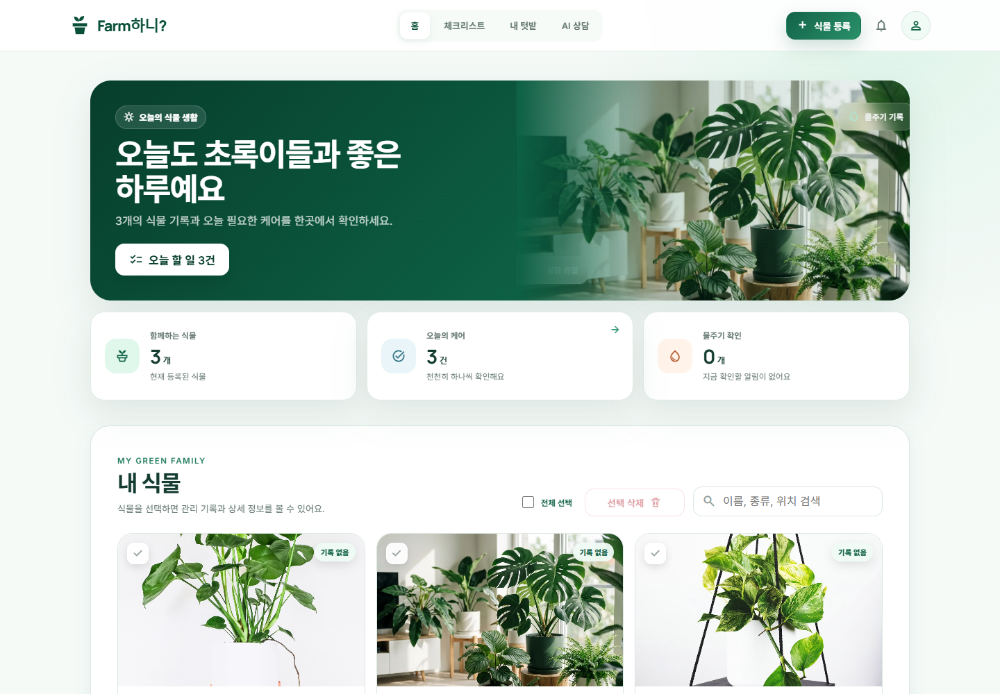
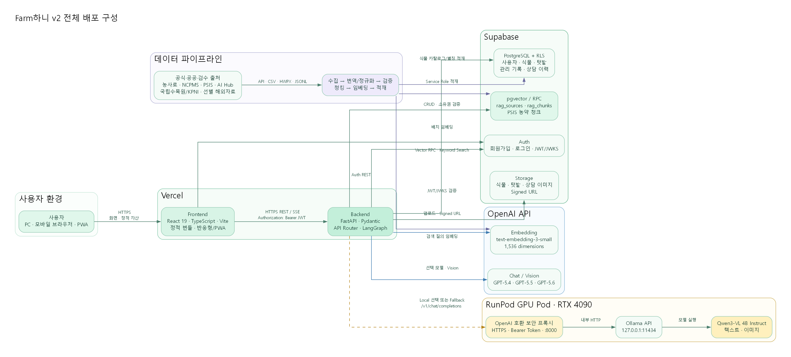
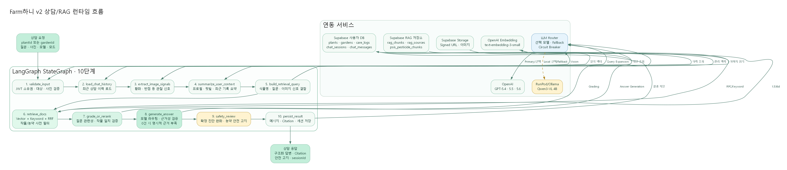
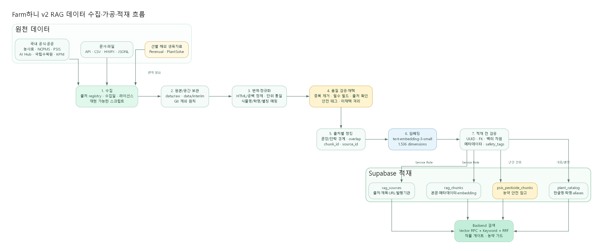

# Farm하니? 🌱

> 식물·텃밭 사진과 재배 기록을 입력하면 공식 원예·농업 문서를 근거로 현재 상태와 오늘의 관리 행동을 알려주는 **멀티모달 RAG · 다중 LLM 기반 식물 주치의 AI**



*Farm하니? v2 대시보드 — 내 식물 카드 · 오늘의 관리 체크리스트 · 빠른 AI 상담*

🔗 **배포 서비스** — https://farmhani.vercel.app/

> **Farm하니 v2** — 3차 프로젝트(v1)에서 개발한 서비스를 4차 단위 프로젝트에서 전면 재설계·확장한 버전입니다.
> 프론트엔드를 React 컴포넌트 구조로 다시 설계하고, 텃밭 통합 상담·다중 LLM·로컬 모델 Fallback·멀티모달 이미지 처리·RAG 안전 가드를 추가했습니다.

---

## 팀원 소개

**SKN30 4차 단위 프로젝트 · 3팀**

| 이름 | 역할 | 주요 담당 |
|---|---|---|
| **채동현**  | 총괄 팀장 · 프론트 | 프로젝트 총괄 및 일정 관리, 프론트엔드 UI 설계·구현, 데이터 수집 파이프라인 구축, 서비스 통합 구현 및 배포 |
| **강성준**  | 백엔드 · RAG | LangGraph 기반 RAG 답변 파이프라인 설계·구현, Supabase 서버 구축 |
| **남태식**  | 백엔드 · RAG | LangGraph 기반 RAG 답변 파이프라인 설계·구현, Supabase 서버 구축 |
| **김도훈**  | 데이터 | 데이터 수집 파이프라인 구현 및 전처리, RAG 데이터 적재 |
| **김범중**  | 데이터 | 데이터 수집 파이프라인 구현 및 전처리, RAG 데이터 적재 |

---

## 서비스 소개

사용자가 등록한 식물·텃밭 프로필, 재배 기록, 사진을 바탕으로 AI가 현재 상태를 진단하고 맞춤 관리 가이드를 제공합니다.
병명 확정 진단 대신 **공식 농업·원예 자료를 근거로 의심 상태와 오늘 할 일**을 안내하는 것이 핵심 원칙입니다.

기존 농업 플랫폼의 병해충 상담은 이웃 문답형 커뮤니티에 가까워 답변까지 오래 걸리고 정확성 검증이 어렵습니다.
Farm하니는 **공식 문서 기반 RAG가 내 식물의 기록·사진과 결합해 즉시, 출처와 함께 답변**하는 방식으로 이 한계를 해결합니다.

### 주요 기능

| 기능 | 설명 |
|---|---|
| 식물 프로필 관리 | 식물명·품종·위치 등록, 사진 업로드·갱신, 재배·물주기 기록, 선택 삭제 |
| 텃밭 통합 관리 | 단일/복합 작물 텃밭 CRUD, 등록 식물 배정, 텃밭 대표 사진 |
| 단일·텃밭 상담 전환 | 식물 한 개 또는 텃밭 전체를 하나의 상담 맥락으로 자유롭게 전환 |
| 전문가 상담 모드 | 객관적·행동 중심 말투로 상태 분석 및 관리 가이드 제공 |
| 내 식물과 대화 모드 | 식물이 1인칭으로 말하는 발랄하고 친근한 대화형 모드 |
| 멀티 LLM 선택 | GPT-5.4 / 5.5 / 5.6 및 로컬 Qwen3-VL 중 상담 모델 선택 |
| 멀티모달 이미지 분석 | 사진에서 황화·반점·처짐 등 관찰 신호 추출 후 검색·답변에 반영 |
| RAG 근거 제공 | 답변마다 참조한 공식 문서 출처(Citation) 표시 |
| 모바일 PWA | 하단 내비게이션 · 채팅 우선 · 접이식 상담 설정 패널 · 설치형 지원 |

---

## 기술 스택

| 영역 | 기술 |
|---|---|
| Frontend | React 19 + TypeScript + Vite — 컴포넌트·상태 기반 반응형 UI, 해시 라우팅, PWA |
| Backend | FastAPI + Pydantic (Python 3.11+) — REST + SSE 스트리밍 |
| AI / LLM (주) | OpenAI **GPT-5.4 · GPT-5.5 · GPT-5.6** (채팅 · Vision) |
| AI / LLM (로컬) | **Qwen3-VL 4B Instruct** — RunPod GPU + Ollama, OpenAI 호환 프록시 |
| 임베딩 | OpenAI `text-embedding-3-small` (1,536차원) |
| RAG 워크플로우 | LangGraph StateGraph — 10단계 에이전틱 파이프라인 |
| DB / Auth / Vector / Storage | Supabase (PostgreSQL + pgvector + Auth/RLS + Storage) |
| 배포 | Vercel (Frontend) · Vercel (Backend, FastAPI) · Supabase · RunPod GPU — **전 구간 실배포** |

---

## 시스템 아키텍처



- **프론트/백엔드 분리 배포** — React 프론트엔드와 FastAPI 백엔드를 각각 별도 Vercel 프로젝트로 배포합니다.
- **이중 LLM 라우팅** — 사용자가 OpenAI 모델과 로컬 모델을 선택할 수 있고, OpenAI 장애 시 로컬 모델로 Fallback합니다.
- **보안 경계** — 전 구간 HTTPS · Bearer JWT · CORS 도메인 제한. 비밀값은 환경변수로만 관리하고 프론트에는 공개 키(Anon Key)만 노출합니다.

---

## RAG 파이프라인 — LangGraph 10단계



단순 1회성 벡터 검색이 아니라, 입력 검증부터 멀티모달 신호 병합, 동적 쿼리 생성, 문서 필터링, 안전성 검토까지 이어지는 **에이전틱 워크플로우**입니다. 처리 단계는 SSE로 사용자에게 실시간 표시됩니다.

**입력 이해 (1~4단계)**
식물·텃밭·사진 검증 → 최근 대화 로드 → Vision 이상 신호 추출 → 사용자·재배 맥락 요약

**검색 (5~6단계)**
LLM 쿼리 확장 → pgvector 유사도 + 키워드 하이브리드 검색(RRF 병합).
**작물 게이트**로 질문 식물과 다른 작물 문서를 차단하고, **농약 가드**로 농약 의도가 없는 질문에 농약 문서가 혼입되지 않도록 사전 필터링합니다.

**검증·필터링 (7단계) — 핵심**
`grade_or_rerank`: LLM이 후보 문서를 하나씩 읽고 질문 식물종·관련성과 일치하는지 검증.
무관한 문서를 엄격히 탈락시켜 환각을 원천 차단 — *Precision 확보*

**생성·안전 (8~9단계)**
전문가 / 내 식물과 대화 모드에 맞춘 답변 생성 + **근거성(Grounding) 검증**.
근거가 0건이면 생성을 건너뛰고 근거 부족을 명시하며, `safety_review`가 확정 진단을 완화하고 농약 답변에 안전 고지를 강제 조립합니다.

**영속화 (10단계)**
답변·출처·세션 제목을 Supabase에 저장 — 식물·텃밭별 상담 이력 보존

---

## 멀티 LLM 선택 및 장애 대응

| UI 표시 | API 모델 ID | 제공자 | 비고 |
|---|---|---|---|
| GPT-5.4 | `gpt-5.4` | OpenAI | 채팅 · Vision |
| GPT-5.5 | `gpt-5.5` | OpenAI | 채팅 · Vision |
| GPT-5.6 | `gpt-5.6-sol` | OpenAI | 채팅 · Vision |
| Local | `qwen3-vl:4b-instruct` | RunPod / Ollama | 이미지는 Base64 변환 후 처리 |

- **선택형 Fallback** — OpenAI 호출이 timeout·5xx·키 미설정으로 실패하면 로컬 모델로 전환합니다. 단, 잘못된 요청 등 **비재시도 오류는 Fallback 대상에서 제외**합니다.
- **Circuit Breaker** — 연속 실패가 임계값에 도달하면 일정 시간 OpenAI 호출을 건너뛰고 로컬로 직행합니다. 임계값·유지 시간·응답 제한은 환경변수로 조정합니다.
- **상태 정직성** — 모델 상태는 런타임에 실제 확인해 초록/빨강으로 표시하고, 두 제공자 모두 실패하면 일반 답변으로 위장하지 않고 사용 불가를 명확히 안내합니다.
- **공통 규칙 적용** — 선택 모델과 무관하게 **동일한 RAG 근거·출처·안전 규칙**이 적용됩니다.

---

## RAG 품질 개선 및 평가

**LLM-as-a-Judge 자동 평가 프레임워크**(gpt-4o-mini Judge · 12개 골든셋)를 구축하고, 이를 기반으로 검색 품질을 정량 추적하며 개선했습니다.


### 핵심 개선 기법

- **Two-Stage Retrieval**: 임계값 0.32→0.25 완화로 Recall 확보 후, `grade_or_rerank`로 Precision 정제
- **한국어 조사 제거 휴리스틱**: "몬스테라는" → "몬스테라" 추출로 키워드 매칭 노이즈 제거
- **RRF 하이브리드 병합**: 벡터 + 키워드 검색 결과를 Reciprocal Rank Fusion으로 재정렬
- **작물 게이트 · 농약 가드**: 다른 작물 문서 혼입과 농약 문서 오혼입을 사전 차단
- **환각 방지**: 근거 문서가 없으면 "모른다"를 선언 — 무관 문서 강제 주입 로직 제거

> 검색 정확도 **3.58 → 4.83점** 대폭 개선, 사진 반영 **만점(5.00)** 달성

---

## 데이터 파이프라인



공공·공식 데이터 소스에서 수집·번역·정규화·검증을 거쳐 Supabase pgvector에 **총 4,841건의 청크**를 통합 적재했습니다.

| 출처 | 내용 | 적재량 |
|---|---|---:|
| NCPMS 병해충 | 병·해충 증상 · 발생 조건 · 예방·방제 | 2,152건 |
| PSIS 농약 정보 | 농약등록정보 — 안전 참고 전용 | 1,268건 |
| 농사로 | 작물 재배 · 농작업 일정 · 실내식물 · 텃밭 관리 | 829건 |
| 국립수목원 도감 | 표준식물명 · 학명 · 이명 · 생육·형태 | 272건 |
| AI Hub | 관수·생육 단계·환경 보조 메타 | 143건 |
| 농업날씨365 | 기상 컨텍스트 · 기후 위해 가이드 | 100건 |
| 네이버 지식백과 | 식물 보조 지식 문서 | 49건 |
| PlantSolve (해외) | 해외 생육·케어 자료 — 품질 검증 후 선별 채택 | 28건 |
| **합계** | | **4,841건** |

> **양보다 출처·안전 우선** — 해외 자료 PlantSolve는 원본 98건 중 학명 일치·번역 품질을 통과한 **28건만 채택**했고, 식물별 고유성이 낮고 농약 일반화 위험이 있는 **EPPO·Perenual 데이터는 전량 제외**했습니다.

### 전처리 파이프라인

```
수집 (공공 API·CSV·HWPX) → 텍스트 정제 (HTML·공백 제거) → 공통 RAG JSONL 정규화
→ 식물명 메타 태깅 → 번역·품질 검증·채택 → 문장 경계 보존 청킹 → 임베딩 (1,536차원)
→ 적재 전 검증 (UUID·FK·차원·안전 태그) → Supabase 적재
```

**출처별 가변 청킹 전략**

| 대상 | 파라미터 (최대 글자 / overlap) | 근거 |
|---|---|---|
| NCPMS 병해충 | 1,400자 / 160자 | 증상·발생조건·방제를 독립 청크로 분리 |
| PSIS 농약 그룹 | 2,200자 / 250자 | 제품명·성분 정보를 같은 검색 단위에 유지 |
| 농사로 텃밭·관리 | 1,200자 / 140자 | 물주기·광도 등 항목형 정보에 최적 |
| 국립수목원 생육 | 약 1,400자 / 160자 | 형태·환경·번식 문맥 보존 |

- `category`로 문서 성격 구분, `usage_scope`로 RAG 사용 범위 제어 (`rag` / `reference_only` / `safety_reference_only`)
- 병해충·농약 문서에는 `pesticide_caution`, `expert_check_required` 등 **안전 태그**를 주입
- 자동 정합성 검증(`validate_processed_data.py`) **PASS** — UUID 고유성, FK 연결, 벡터 차원, 안전 태그 주입 검증

---

## 주요 API 엔드포인트

| 메서드 | 경로 | 설명 |
|---|---|---|
| GET | `/health` | 서버 상태 확인 |
| — | `/api/v1/plants` | 사용자 식물 목록 · 등록 · 상세 · 수정 · 삭제 |
| — | `/api/v1/plants/{id}/care-logs` | 재배·물주기 기록 등록·수정·삭제 |
| POST | `/api/v1/plants/{id}/photos` | 식물 사진 메타데이터 등록 |
| — | `/api/v1/gardens` | 텃밭 목록 · 등록 · 수정 · 삭제 |
| POST | `/api/v1/uploads` | Signed URL · 식물/텃밭 사진 업로드 |
| POST | `/api/v1/chat/plant-care` | 단일 식물·텃밭 RAG 상담 |
| POST | `/api/v1/chat/plant-care/stream` | 상담 진행 단계 SSE 스트리밍 |
| GET | `/api/v1/chat/model-info` | 선택 모델과 런타임 상태 조회 |
| — | `/api/v1/chat/sessions` | 상담방 · 메시지 · 피드백 관리 |
| GET | `/api/v1/rag/search` | 공식 RAG 문서 검색 |
| GET | `/api/v1/plant-catalog` | 식물 품종 도감 조회·검색 |
| GET | `/docs` | Swagger UI (API 문서) |

## Supabase 테이블 구조

| 테이블 | 역할 |
|---|---|
| `profiles` | 사용자 프로필 |
| `plants` / `care_logs` / `plant_photos` | 식물 프로필 · 재배 기록 · 사진 메타데이터 |
| `gardens` | 텃밭 · 재배 유형 · 대표 작물 |
| `chat_sessions` / `chat_messages` / `chat_feedback` | 상담방 · 메시지·Citation · 피드백 |
| `rag_sources` / `rag_chunks` | RAG 문서 소스 메타 · 청크(pgvector) |
| `psis_pesticide_chunks` | 농약 안전 참고 전용 문서 |
| `plant_catalog` | 식물 품종 도감 (한글명 · 학명 · 이명) |

---

## 프로젝트 구조

```text
.
├── README.md
├── AGENTS.md                  # Agent 협업 규칙
├── .env.example               # 환경변수 템플릿
├── pyproject.toml / uv.lock   # 루트 Python 의존성 (uv)
├── vercel.json                # Vercel 프론트엔드 배포 설정
├── contracts/
│   └── api/openapi.yaml       # 프론트-백엔드 API 계약
├── docs/                      # 요구사항·화면설계·시스템 구성도·RAG/테스트 보고서, 발표자료
│   └── assets/                # README·문서 이미지 (screens-v2 · system-v2 포함)
├── frontend/                  # React 19 + TypeScript + Vite
│   ├── public/                # manifest.webmanifest · sw.js (PWA)
│   └── src/
│       ├── App.tsx            # 메인 앱 (해시 라우팅 · 인증 보호 · 지연 로딩)
│       ├── components/        # AppShell · pages(로그인·대시보드·식물·텃밭·상담)
│       ├── api.ts             # 백엔드·Supabase API 호출
│       ├── types.ts           # 식물·텃밭·상담·모델 계약 타입
│       └── lib/               # storage · constants 유틸리티
├── backend/                   # FastAPI + LangGraph
│   ├── index.py               # Vercel 진입점 (app.main:app 노출)
│   ├── vercel.json            # Vercel 백엔드 배포 설정
│   ├── requirements.txt       # 백엔드 의존성
│   └── app/
│       ├── main.py            # 앱 진입점 (CORS · 라우터 등록)
│       ├── api/v1/            # plants · gardens · uploads · chat · rag · catalog
│       ├── services/rag/      # 10단계 RAG 파이프라인 · vectorstore · vision
│       ├── services/llm/      # 모델 라우팅 · Fallback · Circuit Breaker
│       ├── auth/              # Supabase JWT 인증 (JWKS 로컬 검증)
│       ├── core/config.py     # 환경변수 · 모델 · CORS · timeout 설정
│       └── schemas/           # Pydantic 스키마
├── data/
│   ├── raw / interim / processed / vectorstore   # 단계별 데이터 산출물
│   └── scripts/               # 수집·정규화·청킹·임베딩·적재 스크립트
├── supabase/
│   └── migrations/            # 테이블 · RLS · RPC (텃밭·상담·농약 확장)
└── server/                    # 배포 보조 설정
```

---

## 로컬 실행

```bash
# 환경변수 (Supabase URL/Key, OpenAI API Key, 로컬 모델 설정 등 입력)
cp .env.example .env

# Backend — FastAPI
cd backend
python -m venv .venv
source .venv/bin/activate        # Windows: .venv\Scripts\activate
pip install -r requirements.txt
uvicorn app.main:app --reload --port 8000

# Frontend — React + Vite
cd frontend
npm install
npm run dev                      # http://localhost:5173
```

> 로컬 모델(Qwen3-VL)은 RunPod GPU + Ollama의 OpenAI 호환 프록시를 통해 연결합니다.
> `LOCAL_LLM_BASE_URL`(끝에 `/v1` 포함)과 Bearer 토큰을 설정하지 않으면 OpenAI 모델만 사용됩니다.

### 테스트 · 빌드

```bash
# 백엔드 자동 테스트 (2026-07-31 develop 기준 187건 통과)
python -m pytest backend/tests -q

# 프론트엔드 타입 검사 + 프로덕션 빌드
cd frontend && npm run build
```

---

## 현재의 한계와 확장 계획

**한계**

- 방대한 식물 종 대비 데이터 수집이 아직 완전하지 않음 — 문서가 없는 식물은 상담 근거 부족(이 경우 "근거 부족"을 명시)
- RAG 검색·재정렬은 지속 고도화가 필요하며, 실환경 E2E와 로컬 모델 재시험 등 최종 검증 항목이 남아 있음
- Circuit Breaker 상태는 Vercel Function 인스턴스 메모리 기준이라 인스턴스 간 완전한 전역 상태를 보장하지는 않음

**확장 계획**

- 소규모 반려식물 → **대규모 농사·전문 관리 도메인**으로 확장
- PSIS 농약등록정보를 안전 참고 전용으로 적재 완료 — `usage_scope` 설계 덕분에 데이터 재수집 없이 정책 변경만으로 전문 방제 가이드(적용 약제·안전 희석 배수) 기능으로 확장 가능
- 물주기 자동 리마인드·모바일 알림 고도화, 이미지 진단 정확도 개선, 로컬 모델 상시 가용성 확보

---

## 보안 원칙

- `.env`, API 키, Supabase Service Role Key, 로컬 프록시 토큰은 Git에 커밋하지 않습니다.
- 사용자별 데이터는 Supabase JWT 인증과 RLS로 분리하고, Service Role Key는 백엔드에서만 사용합니다.
- 업로드 파일은 허용된 이미지 형식과 최대 8MB 제한을 검증합니다.
- 병해충·농약 관련 답변은 확정 진단·직접 처방 표현을 사용하지 않고, 전문가 확인·제품 라벨·안전사용기준 안내를 포함합니다.
- RAG 답변은 반드시 실제 사용한 문서의 출처 메타데이터(Citation)를 포함합니다.

---

## 관련 문서

- [요구사항 정의서](docs/Farm하니_v2_요구사항_정의서.md) · [화면설계서](docs/Farm하니_v2_화면설계서.md) · [시스템 구성도](docs/Farm하니_v2_시스템_구성도.md)
- [통합테스트 계획서](docs/Farm하니_v2_통합테스트_계획서.md) · [통합테스트 결과보고서](docs/Farm하니_v2_통합테스트_결과보고서.md)
- [RAG 품질 개선 보고서(4차)](docs/RAG품질개선보고서(4차).md)
