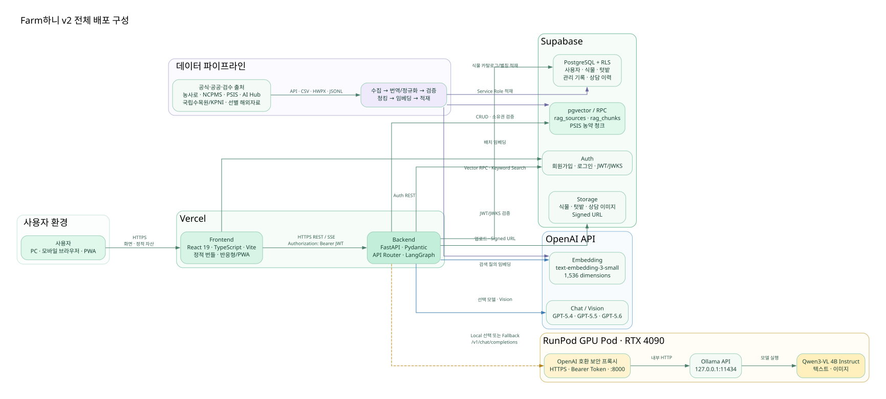
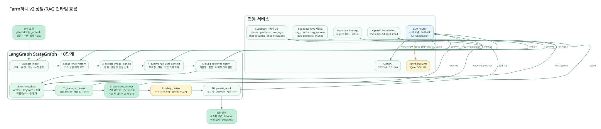
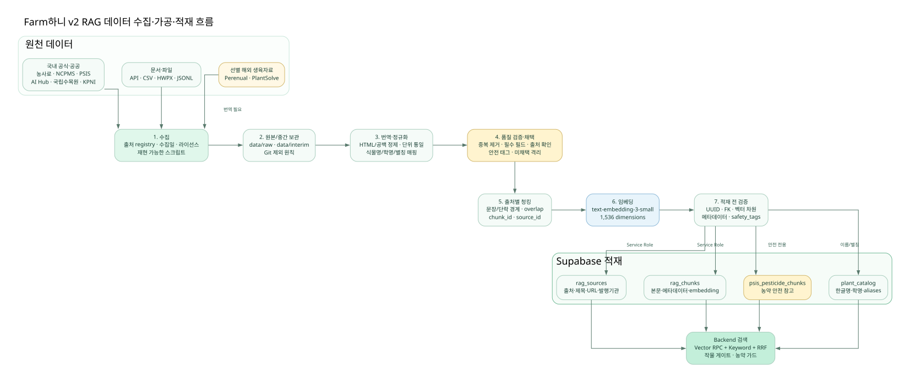

# Farm하니 v2 시스템 구성도

| 항목 | 내용 |
|---|---|
| 문서명 | Farm하니 v2 시스템 구성도 |
| 프로젝트 | SKN30 4차 단위 프로젝트 · Farm하니 v2 |
| 문서 버전 | 1.0 |
| 작성일 | 2026-07-31 |
| 기준 브랜치 | `develop` |
| 기준 커밋 | `f55fd35` |
| 관련 문서 | `Farm하니_v2_요구사항_정의서.md`, `Farm하니_v2_화면설계서.md` |
| 프론트 배포 | <https://farmhani.vercel.app/> |
| 문서 상태 | 4차 프로젝트 산출물 제출용 초안 |

## 1. 문서 목적

본 문서는 Farm하니 v2의 배포 환경, 애플리케이션 구성요소, 상담/RAG 처리 흐름, 데이터 수집·가공·적재 구조와 보안·장애 대응 경계를 정의한다.

다음 내용을 하나의 기준으로 통합하는 것을 목적으로 한다.

- React 프론트엔드와 FastAPI 백엔드의 배포 구조
- Supabase Auth·PostgreSQL·Storage·pgvector 연동
- OpenAI 및 RunPod/Ollama 로컬 모델 라우팅
- LangGraph 기반 10단계 상담/RAG 처리
- 공식·공공 문서 데이터 파이프라인
- 인증, 비밀값, 사용자 이미지와 농약 정보의 안전 경계
- 운영 환경 장애 시 fallback 및 확인 방법

## 2. PDF 변환 기준

시스템 구성도는 벡터 SVG를 본문에 사용한다. PDF 변환 시 확대해도 글자와 선이 깨지지 않으며, SVG를 지원하지 않는 변환 도구를 위해 동일 이름의 고해상도 PNG도 함께 제공한다.

| 항목 | 권장값 |
|---|---|
| 용지 | A4 |
| 방향 | 가로(Landscape) |
| 여백 | 상·하 12mm, 좌·우 12~14mm |
| 기본 이미지 | `assets/system-v2/*.svg` |
| 대체 이미지 | `assets/system-v2/*.png` |
| 본문 글꼴 | Pretendard 또는 Noto Sans KR |
| 표 글자 크기 | 8.5~10pt |
| 페이지 분리 | 각 구성도를 별도 페이지에 배치 |

Graphviz 원본인 `assets/system-v2/*.dot`도 함께 보관하여 시스템 변경 시 재생성할 수 있게 한다.

## 3. 설계 원칙

| 원칙 | 적용 내용 |
|---|---|
| 역할 분리 | UI, API, 인증·DB·Storage, LLM, 데이터 파이프라인을 독립 구성요소로 분리 |
| 사용자 격리 | 모든 사용자 데이터 API는 JWT 검증 후 사용자 소유권 기준으로 접근 |
| 근거 우선 | 상담 답변은 검색된 공식 문서와 Citation을 기준으로 생성 |
| 안전한 실패 | 근거 0건, 모델 장애, 이미지 분석 실패를 정상 분기 또는 명확한 오류로 처리 |
| 제공자 독립성 | 공통 OpenAI 호환 인터페이스와 모델 라우터로 OpenAI·로컬 모델 전환 |
| 재현 가능한 데이터 | 수집·번역·정규화·청킹·임베딩·적재를 스크립트로 재현 |
| 비밀값 분리 | API Key, Service Role Key, DB 비밀번호와 프록시 토큰을 환경변수로만 관리 |
| 사용자 이미지 보호 | 이미지 사용을 상담 처리 범위로 제한하고 동의 없는 학습 재사용 금지 |

## 4. 전체 배포 구성도

_그림 1. Farm하니 v2 전체 배포 구성 — SVG 벡터 원본_

### 4.1 배포 단위

| 영역 | 배포 위치 | 기술 | 주요 책임 |
|---|---|---|---|
| 사용자 클라이언트 | PC·모바일 브라우저 | HTML, CSS, JavaScript, PWA | 화면 표시, 사용자 입력, 이미지 선택, API 호출 |
| Frontend | Vercel 정적 배포 | React 19, TypeScript, Vite | 페이지·상태·반응형 UI, Supabase Auth 연결, FastAPI 호출 |
| Backend | 별도 Vercel FastAPI 프로젝트 | Python, FastAPI, Pydantic | 인증 검증, CRUD API, 업로드, LangGraph, LLM 라우팅 |
| 인증·DB·Storage | Supabase | Auth, PostgreSQL, RLS, Storage, pgvector | 사용자 인증, 영속 데이터, 이미지, 벡터 검색 |
| 주 LLM | OpenAI API | GPT-5.4, GPT-5.5, GPT-5.6, Embedding | 채팅·비전·검색 질의 임베딩 |
| 로컬 LLM | RunPod RTX 4090 | Ollama, Qwen3-VL 4B Instruct | 명시적 Local 선택 또는 OpenAI 장애 fallback |
| 로컬 모델 프록시 | RunPod Pod | FastAPI/HTTP Proxy, Bearer Token | 외부 HTTPS 요청 인증 후 Ollama API로 전달 |
| 데이터 파이프라인 | 개발·데이터 작업 환경 | Python scripts, JSONL, CSV, HWPX | 수집·번역·정규화·검증·청킹·임베딩·적재 |

### 4.2 Vercel 프로젝트 분리

Farm하니 v2는 프론트엔드와 백엔드를 각각 Vercel 배포 대상으로 관리한다.

| 구분 | 설정 파일 | 빌드/진입점 |
|---|---|---|
| Frontend | `/vercel.json` | `frontend`에서 `npm ci`, `npm run build`, `frontend/dist` 배포 |
| Backend | `/backend/vercel.json` | `backend/index.py`에서 `app.main:app`을 FastAPI 앱으로 노출 |

프론트엔드 배포 URL과 백엔드 배포 URL은 별개이며, 프론트의 `VITE_BACKEND_URL`이 백엔드 Vercel 도메인을 가리켜야 한다. 백엔드 `CORS_ORIGINS`에는 실제 프론트엔드 도메인을 등록한다.

### 4.3 주요 통신 경로

| 발신 | 수신 | 프로토콜/인증 | 데이터 |
|---|---|---|---|
| 브라우저 | Vercel Frontend | HTTPS | 정적 자산, React 앱 |
| 브라우저 | Supabase Auth | HTTPS REST, Anon Key | 회원가입, 로그인, 토큰 갱신 |
| 브라우저 | Vercel Backend | HTTPS REST/SSE, Bearer JWT | 식물·텃밭·상담·업로드 요청 |
| Backend | Supabase Auth/JWKS | HTTPS | JWT 서명키와 사용자 검증 |
| Backend | Supabase PostgreSQL | HTTPS/PostgREST | 사용자 데이터 CRUD, 소유권 검증 |
| Backend | Supabase Storage | HTTPS | 이미지 업로드, Signed URL 생성 |
| Backend | Supabase pgvector | HTTPS RPC/PostgREST | 벡터·키워드 검색 |
| Backend | OpenAI | HTTPS, API Key | 채팅, Vision, Embedding |
| Backend | RunPod Proxy | HTTPS, Bearer Token | OpenAI 호환 `/v1/chat/completions`, `/v1/models` |
| RunPod Proxy | Ollama | Pod 내부 HTTP | OpenAI 호환 요청 전달 |
| Ollama | Qwen3-VL | 로컬 GPU 추론 | 텍스트·이미지 응답 생성 |
| 데이터 적재 스크립트 | Supabase | HTTPS, Service Role Key | 출처·청크·카탈로그 배치 적재 |

## 5. 구성요소 상세

### 5.1 Frontend

| 계층 | 구현 위치 | 역할 |
|---|---|---|
| 진입·라우팅 | `frontend/src/App.tsx`, `lib/constants.ts` | 해시 라우팅, 인증 보호, 페이지 지연 로딩 |
| 공통 Shell | `components/AppShell.tsx` | PC 헤더, 모바일 하단 내비게이션, 알림·프로필 |
| 페이지 | `components/pages/*.tsx` | 로그인, 대시보드, 식물 등록·상세, 텃밭, AI 상담 |
| API Client | `frontend/src/api.ts` | Backend·Supabase 호출, 인증 헤더, 업로드, 응답 매핑 |
| 타입 | `frontend/src/types.ts` | 식물·텃밭·상담·모델 계약 |
| 로컬 상태 | `frontend/src/lib/storage.ts` | 선택 식물·텃밭, 모델 선택, UI 설정 유지 |
| PWA | `public/manifest.webmanifest`, `public/sw.js` | 설치 정보와 서비스 워커 |

Frontend에는 Supabase 공개 Anon Key만 설정하며 OpenAI Key, Supabase Service Role Key와 로컬 프록시 토큰을 포함하지 않는다.

### 5.2 Backend

| 계층 | 구현 위치 | 역할 |
|---|---|---|
| 앱 진입점 | `backend/app/main.py`, `backend/index.py` | FastAPI 생성, CORS, 라우터 등록, Vercel 노출 |
| API Router | `backend/app/api/v1` | plants, gardens, uploads, chat, catalog, rag |
| 요청/응답 계약 | `backend/app/schemas` | Pydantic 유효성 검증과 응답 구조 |
| 인증 | `backend/app/auth/security.py` | Supabase JWT 로컬 검증, 필요 시 원격 확인 |
| 설정 | `backend/app/core/config.py` | 환경변수, 모델, CORS, timeout, fallback 설정 |
| LangGraph | `backend/app/services/rag` | 10단계 상담/RAG 처리 |
| LLM Router | `backend/app/services/llm` | 모델 선택, local fallback, Circuit Breaker, Vision 변환 |
| DB Schema | `backend/app/db`, `supabase/migrations` | 테이블, RLS, RPC, 텃밭·상담·농약 확장 |

### 5.3 Supabase

| 기능 | 주요 객체 | 역할 |
|---|---|---|
| Auth | Supabase Auth, JWT, JWKS | 사용자 인증과 토큰 발급 |
| 사용자 데이터 | `profiles`, `plants`, `gardens`, `care_logs`, `plant_photos` | 식물·텃밭·관리 기록·사진 메타데이터 |
| 상담 데이터 | `chat_sessions`, `chat_messages`, `chat_feedback` | 대화 이력, Citation, 피드백 |
| 식물 도감 | `plant_catalog` | 한글명, 학명, 별칭, 관리 정보 |
| RAG 출처 | `rag_sources` | 출처, 제목, URL, 발행기관 |
| RAG 청크 | `rag_chunks` | 본문, 메타데이터, 임베딩, 식물·증상 태그 |
| 농약 청크 | `psis_pesticide_chunks` | 농약 안전 참고 전용 검색 데이터 |
| Storage | `plant-photos` bucket | 식물·텃밭·상담 이미지 |
| 검색 RPC | `match_rag_chunks` 계열 | cosine similarity 기반 후보 검색 |

### 5.4 OpenAI

| 기능 | 모델/설정 | 사용 위치 |
|---|---|---|
| 답변 생성 | GPT-5.4, GPT-5.5, GPT-5.6 | 사용자가 선택한 상담 답변 |
| 이미지 분석 | 선택 모델 또는 `VISION_MODEL` | 식물·텃밭 이미지 관찰 신호 추출 |
| 질의 확장·문서 평가 | 설정된 Chat 모델 | 검색 질의 생성과 문서 관련성 평가 |
| 임베딩 | `text-embedding-3-small` | 검색 질의 및 적재 문서의 1,536차원 벡터 생성 |

Frontend 표시는 GPT-5.6이지만 Backend·API 계약의 실제 ID는 `gpt-5.6-sol`이다.

### 5.5 RunPod/Ollama 로컬 모델

| 구성요소 | 설정/역할 |
|---|---|
| GPU Pod | RTX 4090, 영속 `/workspace` 볼륨 사용 |
| Ollama | Pod 내부 `127.0.0.1:11434`에서 실행 |
| 모델 | `qwen3-vl:4b-instruct` |
| 외부 프록시 | 포트 8000, OpenAI 호환 `/v1` 경로 |
| 인증 | `Authorization: Bearer <OLLAMA_PROXY_TOKEN>` |
| Backend 연결 | `LOCAL_LLM_BASE_URL=https://<POD_ID>-8000.proxy.runpod.net/v1` |
| 용도 | 사용자가 Local 선택 또는 OpenAI 장애 fallback |

RunPod Pod가 중지되면 로컬 모델은 사용할 수 없다. Backend의 모델 상태 API는 `/v1/models`를 짧은 timeout으로 확인하고 Frontend는 실제 사용 가능 여부에 따라 초록 또는 빨간 상태를 표시한다.

## 6. 인증 및 사용자 데이터 흐름

### 6.1 로그인

1. 사용자가 Frontend 로그인 화면에 이메일과 비밀번호를 입력한다.
2. Frontend가 Supabase Auth REST API를 호출한다.
3. Supabase가 Access Token과 Refresh Token을 반환한다.
4. Frontend는 Backend 요청의 `Authorization: Bearer <JWT>` 헤더에 Access Token을 포함한다.
5. 세션 만료 시 토큰 갱신을 시도하고 실패하면 로그인 화면으로 이동한다.

### 6.2 Backend 인증

1. Backend가 Bearer JWT 존재 여부를 확인한다.
2. JWKS 공개키를 사용해 서명, audience, 만료와 허용 clock skew를 검증한다.
3. 로컬 검증이 불가능한 일시적 상황에서만 제한적으로 Supabase 원격 사용자 확인을 사용한다.
4. 무효 토큰은 401, 인증 서비스 장애는 503으로 구분한다.
5. 검증된 `user_id`를 식물·텃밭·상담 쿼리에 적용한다.

### 6.3 소유권 규칙

- 식물과 텃밭은 요청 사용자 소유 데이터만 조회·수정한다.
- 관리 기록과 사진은 상위 식물 또는 텃밭 소유권을 따라간다.
- 상담 세션은 사용자와 식물 또는 텃밭 중 하나에 연결한다.
- 텃밭 삭제 시 식물은 삭제하지 않고 소속만 해제한다.
- Supabase RLS와 Backend 소유권 검사를 함께 사용한다.

## 7. 이미지 업로드 및 멀티모달 흐름

### 7.1 식물·텃밭 대표 사진

1. Frontend가 JPG·PNG·WEBP 및 8MB 제한을 검증한다.
2. Backend 업로드 API 또는 Signed URL을 통해 Supabase Storage에 저장한다.
3. 저장 경로와 이미지 URL을 `plant_photos` 및 식물·텃밭 메타데이터에 기록한다.
4. 식물 사진 변경 시 대시보드와 상세 화면이 최신 대표 이미지를 다시 조회한다.

### 7.2 상담 이미지

1. 사용자가 상담 입력창에서 이미지를 선택·드래그·붙여넣기한다.
2. Frontend가 미리보기를 표시하고 전송 시 이미지를 Storage에 업로드한다.
3. Backend가 사진 ID와 소유권을 확인한다.
4. OpenAI Vision 경로는 접근 가능한 Supabase Signed URL을 전달한다.
5. Local Vision 경로는 설정된 Supabase 호스트의 이미지만 다운로드한다.
6. MIME type과 8MB 제한을 재검증한 뒤 Base64 data URL로 변환하여 Ollama에 전달한다.
7. 이미지 분석 결과는 병명 확정이 아니라 황화·반점·처짐 등 관찰 신호로 RAG 검색에 결합한다.

## 8. 상담/RAG 런타임 구성도

_그림 2. LangGraph 10단계 상담/RAG 런타임 흐름 — SVG 벡터 원본_

### 8.1 LangGraph 단계

| 단계 | 노드 | 입력 | 처리 | 출력 |
|---:|---|---|---|---|
| 1 | `validate_input` | user ID, plant/garden ID, photo ID | 소유권, 대상 존재, 사진 접근 검증 | 검증된 상담 대상 |
| 2 | `load_chat_history` | session ID, 대상, 모드 | 최근 상담 메시지 로드 | 대화 맥락 |
| 3 | `extract_image_signals` | Signed URL, 선택 모델 | Vision 분석, 관찰 신호 구조화 | 황화·반점·심각도·설명 |
| 4 | `summarize_user_context` | 프로필, 텃밭, care logs | 사용자·재배 맥락 요약 | 컨텍스트 문자열 |
| 5 | `build_retrieval_query` | 질문, 대상명, 이미지 신호, 맥락 | 식물명·증상 중심 검색 질의 확장 | 검색 질의 목록 |
| 6 | `retrieve_docs` | 검색 질의 | Vector + Keyword, RRF, 작물·농약 사전 필터 | 후보 문서 |
| 7 | `grade_or_rerank` | 질문, 후보 문서 | 관련성·식물 일치 여부 평가 | 최종 근거 문서 |
| 8 | `generate_answer` | 질문, 맥락, 근거 문서, 모델 | 답변 생성, 근거성 검증, 근거 0건 처리 | 구조화 답변 초안 |
| 9 | `safety_review` | 답변, 문서 안전 태그 | 확정 진단 완화, 농약 안전 고지 강제 | 안전한 답변 |
| 10 | `persist_result` | 질문, 답변, Citation | 메시지·출처·세션 제목 저장 | response, session ID |

### 8.2 검색 구조

| 단계 | 구현 방식 | 목적 |
|---|---|---|
| 질의 임베딩 | OpenAI `text-embedding-3-small` | 의미적으로 유사한 문서 후보 수집 |
| Vector Search | Supabase pgvector RPC | cosine similarity 기반 후보 검색 |
| Keyword Search | 식물명·증상 키워드, 한국어 조사 제거 | 짧은 질문과 고유 식물명 보완 |
| RRF | Vector·Keyword 순위 병합 | 단일 검색 방식의 편향 완화 |
| 식물명 확장 | 한글명·학명·별칭·표기 변형 | 동일 식물의 다양한 입력 대응 |
| 작물 게이트 | 질문 대상과 문서의 crop/plant 메타데이터 비교 | 다른 식물 문서 혼입 차단 |
| 농약 가드 | 농약 의도와 문서 safety tag 확인 | 일반 관리 질문의 농약 문서 혼입 차단 |
| LLM 재평가 | `grade_or_rerank` | 질문 관련성과 직접적 유용성 확인 |

### 8.3 근거성 처리

| 조건 | 처리 |
|---|---|
| 최종 근거 문서 1건 이상 | 근거 문서를 생성 프롬프트에 포함하고 Citation 반환 |
| 답변 주장이 문서에 기반함 | 모델 답변 유지 |
| 답변이 검색 근거를 충분히 반영하지 않음 | 문서 발췌 기반 fallback 답변으로 교체 |
| 최종 근거 문서 0건 | LLM 상세 생성 대신 근거 부족을 명시하고 추가 사진·기록 요청 |
| 농약 안전 태그 존재 | 전문가 확인, 제품 라벨, 안전사용기준 안내 강제 |

## 9. LLM 모델 라우팅과 Fallback

### 9.1 선택 모델

| UI 표시 | API 모델 ID | 제공자 | 텍스트 | 이미지 |
|---|---|---|---:|---:|
| GPT-5.4 | `gpt-5.4` | OpenAI | 지원 | 지원 경로 |
| GPT-5.5 | `gpt-5.5` | OpenAI | 지원 | 지원 경로 |
| GPT-5.6 | `gpt-5.6-sol` | OpenAI | 지원 | 지원 경로 |
| Local | `local` → `qwen3-vl:4b-instruct` | RunPod/Ollama | 지원 | Base64 변환 후 지원 |

### 9.2 라우팅 규칙

| 조건 | 처리 결과 |
|---|---|
| 사용자가 Local 선택 | OpenAI를 호출하지 않고 로컬 모델 직접 호출 |
| 사용자가 OpenAI 모델 선택, 정상 상태 | 선택한 OpenAI 모델 호출 |
| OpenAI Key 미설정, fallback 활성 | 로컬 모델 직접 호출 |
| OpenAI timeout·연결 오류·5xx, fallback 활성 | 실패 기록 후 로컬 모델 호출 |
| OpenAI 잘못된 요청·지원하지 않는 모델 | 비재시도 오류로 처리하고 무조건 fallback하지 않음 |
| 연속 실패가 임계값 도달 | Circuit Breaker를 열고 설정 시간 동안 OpenAI 호출 건너뜀 |
| Circuit Open, fallback 활성 | 로컬 모델 직접 호출 |
| OpenAI·Local 모두 실패 | `LLMUnavailableError`를 사용자 오류 응답으로 변환 |

### 9.3 보조 LLM 호출

RAG의 질의 확장·문서 grading 같은 보조 호출까지 모두 로컬 fallback으로 보내면 한 번의 상담이 다수의 긴 로컬 요청으로 증가할 수 있다. 운영 환경에서는 `LOCAL_LLM_AUXILIARY_ENABLED=false`를 기본 권장하며, 최종 답변과 Vision 경로의 fallback부터 적용한다.

### 9.4 Circuit Breaker

| 환경변수 | 의미 |
|---|---|
| `LLM_FAILURE_THRESHOLD` | Circuit을 열기 위한 연속 실패 횟수 |
| `LLM_CIRCUIT_OPEN_SECONDS` | OpenAI 재시도 전 대기 시간 |
| `LOCAL_LLM_TIMEOUT_SECONDS` | 로컬 모델 요청 제한 시간 |

Circuit 상태는 Vercel Function 인스턴스 메모리 기준이므로 인스턴스 간 완전한 전역 상태를 보장하지 않는다. 현재 프로젝트 범위에서는 요청 폭주와 반복 실패를 줄이는 프로세스 단위 보호 장치로 사용한다.

## 10. RAG 데이터 파이프라인 구성도

_그림 3. 공식·공공·선별 해외자료의 수집·가공·적재 흐름 — SVG 벡터 원본_

### 10.1 데이터 소스

| 구분 | 주요 출처 | 사용 목적 |
|---|---|---|
| 작물·실내식물 관리 | 농사로 | 재배, 물주기, 생육, 작업 일정 |
| 병해충 | NCPMS | 증상, 발생 조건, 예방·방제 참고 |
| 농약 안전 | PSIS | 등록 정보와 안전사용 참고 |
| 이미지·생육 메타 | AI Hub | 관수·생육 단계·환경 보조 정보 |
| 식물 도감·표준명 | 국립수목원, KPNI | 한글명, 학명, 별칭 정규화 |
| 해외 생육자료 | Perenual, PlantSolve | 국내 자료의 관리 정보 공백 보완 |

### 10.2 처리 단계

| 단계 | 산출물/검증 |
|---:|---|
| 1. 수집 | 출처 registry, 라이선스, 수집일, 원본 식별자 기록 |
| 2. 원본·중간 보관 | `data/raw`, `data/interim`; 원본 대용량 파일은 Git 제외 원칙 |
| 3. 번역·정규화 | HTML·공백 제거, 단위·필드 통일, 식물명·학명·별칭 매핑 |
| 4. 품질 검증·채택 | 중복, 필수 필드, 출처, 라이선스, 안전 태그 검증; 미채택 자료 격리 |
| 5. 청킹 | 문장·단락 경계, 출처별 chunk size/overlap, UUID 생성 |
| 6. 임베딩 | `text-embedding-3-small`, 1,536차원 벡터 |
| 7. 적재 전 검증 | UUID 고유성, source FK, 벡터 차원, metadata와 safety tag 확인 |
| 8. Supabase 적재 | `rag_sources`, `rag_chunks`, `psis_pesticide_chunks`, `plant_catalog` |

### 10.3 데이터 안전 규칙

- 병해충·농약 문서는 `expert_check_required`, `pesticide_caution` 등의 태그를 가진다.
- 농약 데이터는 일반 관리 답변에 자동 혼입되지 않도록 별도 사용 범위와 가드를 적용한다.
- 해외 문서는 한국어 번역과 필드 정규화 후 품질 기준을 통과한 데이터만 채택한다.
- 채택되지 않은 문서를 적재량 확보 목적으로 억지로 포함하지 않는다.
- 사용자 업로드 이미지는 RAG 원천 문서나 학습 데이터로 재사용하지 않는다.
- Service Role Key는 데이터 적재 환경과 Backend에서만 사용한다.

## 11. 주요 데이터 관계

| 주체 | 하위/연결 데이터 | 관계 규칙 |
|---|---|---|
| 사용자 | profiles, plants, gardens, chat_sessions | 사용자 ID 기준 격리 |
| 식물 | care_logs, plant_photos, chat_sessions | 식물 소유권 상속 |
| 텃밭 | plants, plant_photos, chat_sessions | 식물은 선택적으로 한 텃밭에 소속 |
| 상담 세션 | chat_messages, chat_feedback | 단일 식물 또는 텃밭 중 하나를 대상 |
| RAG 출처 | rag_chunks | 하나의 출처가 여러 청크를 가짐 |
| RAG 청크 | embedding, metadata, crop/plant tags | 검색과 Citation의 최소 근거 단위 |
| PSIS 청크 | 농약 등록·안전 정보 | 농약 의도 및 안전 가드 적용 |

## 12. 환경변수 구성

실제 값은 문서·Git에 기록하지 않고 Vercel, RunPod와 로컬 `.env`에서 관리한다.

### 12.1 Frontend

| 환경변수 | 용도 | 공개 범위 |
|---|---|---|
| `VITE_BACKEND_URL` | Vercel Backend 기본 URL | 브라우저 공개 가능 |
| `VITE_SUPABASE_URL` | Supabase 프로젝트 URL | 브라우저 공개 가능 |
| `VITE_SUPABASE_ANON_KEY` | Supabase 공개 Anon Key | 브라우저 공개 가능 |
| `VITE_SUPABASE_STORAGE_BUCKET` | 이미지 bucket 이름 | 브라우저 공개 가능 |

### 12.2 Backend

| 환경변수 | 용도 | 비밀값 여부 |
|---|---|---:|
| `CORS_ORIGINS` | 허용 Frontend 도메인 | 아니오 |
| `SUPABASE_URL` | Supabase Backend 연결 | 아니오 |
| `SUPABASE_ANON_KEY` | 제한된 공개 API 연결 | 아니오 |
| `SUPABASE_SERVICE_ROLE_KEY` | 관리·업로드·서버 데이터 작업 | **예** |
| `SUPABASE_STORAGE_BUCKET` | 이미지 bucket | 아니오 |
| `OPENAI_API_KEY` | OpenAI API 인증 | **예** |
| `CHAT_MODEL` | 요청에서 모델이 생략된 경우 서버 기본값 | 아니오 |
| `VISION_MODEL` | Vision 기본 모델 | 아니오 |
| `EMBEDDING_MODEL` | 검색 질의 임베딩 모델 | 아니오 |
| `LLM_FALLBACK_ENABLED` | OpenAI→Local fallback 활성 | 아니오 |
| `LOCAL_LLM_AUXILIARY_ENABLED` | 보조 호출의 Local fallback 허용 | 아니오 |
| `LOCAL_LLM_BASE_URL` | RunPod 프록시 `/v1` URL | 제한 정보 |
| `LOCAL_LLM_API_KEY` | RunPod 프록시 Bearer Token | **예** |
| `LOCAL_CHAT_MODEL` | 로컬 Chat 모델 ID | 아니오 |
| `LOCAL_VISION_MODEL` | 로컬 Vision 모델 ID | 아니오 |
| `LLM_FAILURE_THRESHOLD` | Circuit 실패 임계값 | 아니오 |
| `LLM_CIRCUIT_OPEN_SECONDS` | Circuit Open 유지 시간 | 아니오 |
| `LOCAL_LLM_TIMEOUT_SECONDS` | 로컬 요청 timeout | 아니오 |

### 12.3 데이터 파이프라인

| 환경변수 | 용도 |
|---|---|
| `NONGSARO_API_KEY` | 농사로 데이터 수집 |
| `NCPMS_API_KEY` | 병해충 데이터 수집 |
| `PSIS_API_KEY` | 농약 안전 데이터 수집 |
| `AIHUB_API_KEY` | AI Hub 데이터 접근 |
| `OPENAI_API_KEY` | 배치 임베딩 |
| `SUPABASE_SERVICE_ROLE_KEY` | 검증된 데이터 적재 |

## 13. 보안 경계

| 경계 | 보호 방식 |
|---|---|
| 브라우저 ↔ Backend | HTTPS, Bearer JWT, CORS 제한 |
| Backend ↔ Supabase | 서버 환경변수, JWT/JWKS, Service Role 제한 사용 |
| 사용자 데이터 | user ID 소유권 필터, RLS, 상위 자원 소유권 검증 |
| 이미지 | 파일 형식·8MB 검증, Signed URL, 허용 Supabase 호스트 검사 |
| Backend ↔ OpenAI | 서버 전용 API Key, HTTPS |
| Backend ↔ RunPod | HTTPS 프록시, Bearer Token, Ollama의 외부 직접 노출 금지 |
| 데이터 적재 | Service Role Key를 로컬/운영 비밀값으로만 사용 |
| Git 저장소 | `.env`, 토큰, 원본 대용량 데이터, 사용자 업로드 제외 |

## 14. 장애 대응 및 운영 확인

### 14.1 장애 시 동작

| 장애 | 시스템 동작 | 운영 확인 |
|---|---|---|
| OpenAI Chat timeout/5xx | 설정에 따라 Local fallback | Backend 로그, Circuit 상태 |
| OpenAI Key 소진·미설정 | Local 사용 가능 시 직접 전환 | Vercel 환경변수와 모델 상태 API |
| RunPod Pod 중지 | Local 빨간 상태, OpenAI 사용 가능 시 OpenAI 선택 | RunPod 상태, `/v1/models` |
| RunPod 프록시 401 | Local 사용 불가 오류 | Backend와 Pod 토큰 일치 여부 |
| Ollama 11434 중지 | 프록시 health/models 실패 | Pod 프로세스, Ollama 로그 |
| OpenAI·Local 모두 실패 | 명확한 모델 사용 불가 응답 | 두 제공자 로그와 환경변수 |
| Embedding API 실패 | Keyword Search fallback | RAG 검색 경고 로그 |
| Vector RPC 실패 | 제한된 Supabase Keyword fallback | RPC·DB migration 상태 |
| 검색 근거 0건 | 근거 부족 명시, 무관 문서 미주입 | Citation 0건과 답변 문구 |
| Vision 분석 실패 | 가능한 경우 텍스트·기록 기반 상담 유지 | 이미지 URL·형식·용량 확인 |
| Supabase Auth 일시 장애 | 재시도 가능한 경우 503 | JWKS/원격 Auth 연결 상태 |

### 14.2 Health Check

| 대상 | 확인 방법 |
|---|---|
| Frontend | `https://farmhani.vercel.app/` 접속과 정적 자산 로드 |
| Backend | `GET /health` → `status: healthy` |
| OpenAI 설정 | `GET /api/v1/chat/model-info`의 primary 상태 |
| Local 설정 | 동일 API의 local 상태 및 RunPod `/v1/models` |
| Ollama | Pod 내부 `GET http://127.0.0.1:11434/api/version` |
| Supabase | 로그인, 식물 목록, Storage Signed URL, RAG RPC |

### 14.3 배포 전 체크리스트

- [ ] Frontend `VITE_BACKEND_URL`이 실제 Backend Vercel 도메인을 가리킨다.
- [ ] Backend `CORS_ORIGINS`에 Frontend 도메인이 등록되어 있다.
- [ ] Supabase URL·Anon Key·Service Role Key가 올바른 Vercel 프로젝트에 설정되어 있다.
- [ ] OpenAI Key와 기본 모델 설정이 유효하다.
- [ ] RunPod Pod가 실행 중이며 8000 포트 프록시가 외부 접근 가능하다.
- [ ] Backend와 RunPod의 Bearer Token이 일치한다.
- [ ] `LOCAL_LLM_BASE_URL` 끝에 `/v1`이 포함되어 있다.
- [ ] `qwen3-vl:4b-instruct` 모델이 Ollama에 내려받아져 있다.
- [ ] `/health`, `/api/v1/chat/model-info`, 로그인, 이미지 업로드, 상담 E2E를 확인한다.
- [ ] 실제 비밀값이 Git과 PDF 산출물에 포함되지 않았는지 확인한다.

## 15. 요구사항 추적

| 시스템 영역 | 연결 요구사항 |
|---|---|
| Vercel Frontend/Backend | FR-UI-001~010, NFR-COMP-001~002, NFR-MNT-001~004 |
| Supabase Auth·사용자 데이터 | FR-AUTH-001~004, NFR-SEC-001~008 |
| 식물·텃밭 DB | FR-PLANT-001~011, FR-GARDEN-001~008 |
| 이미지·Vision | FR-CHAT-007~010, FR-VISION-001~005 |
| LangGraph/RAG | FR-RAG-001~012, NFR-PERF-002~003 |
| 모델 라우팅 | FR-LLM-001~010, NFR-REL-002~005 |
| 데이터 파이프라인 | FR-DATA-001~007, NFR-MNT-005 |
| 테스트·운영 | NFR-TST-001~006, NFR-REL-001~005 |

## 16. PDF 제출 전 확인 항목

- [ ] 세 개의 SVG 구성도가 누락 없이 렌더링된다.
- [ ] 구성도 안의 한글 글꼴이 깨지지 않는다.
- [ ] 선과 화살표가 페이지 밖으로 잘리지 않는다.
- [ ] SVG를 지원하지 않는 경우 동일 이름의 PNG로 교체한다.
- [ ] 표의 마지막 열이 A4 가로 폭 안에 들어오는지 확인한다.
- [ ] 실제 Backend Vercel URL이 확정되면 배포 단위 표와 Health Check에 반영한다.
- [ ] 환경변수 이름만 표시하고 실제 Key·Token 값은 포함하지 않는다.
- [ ] 최신 모델 ID와 RunPod 포트가 운영 설정과 일치하는지 확인한다.
- [ ] 문서 버전, 작성일, 페이지 번호를 머리말·꼬리말에 추가한다.
- [ ] PDF 파일명은 `Farm하니_v2_시스템_구성도.pdf`로 통일한다.

## 17. 변경 이력

| 버전 | 날짜 | 변경 내용 |
|---|---|---|
| 1.0 | 2026-07-31 | Farm하니 v2 전체 배포, 상담/RAG, 데이터 파이프라인 구성도 최초 작성 |
