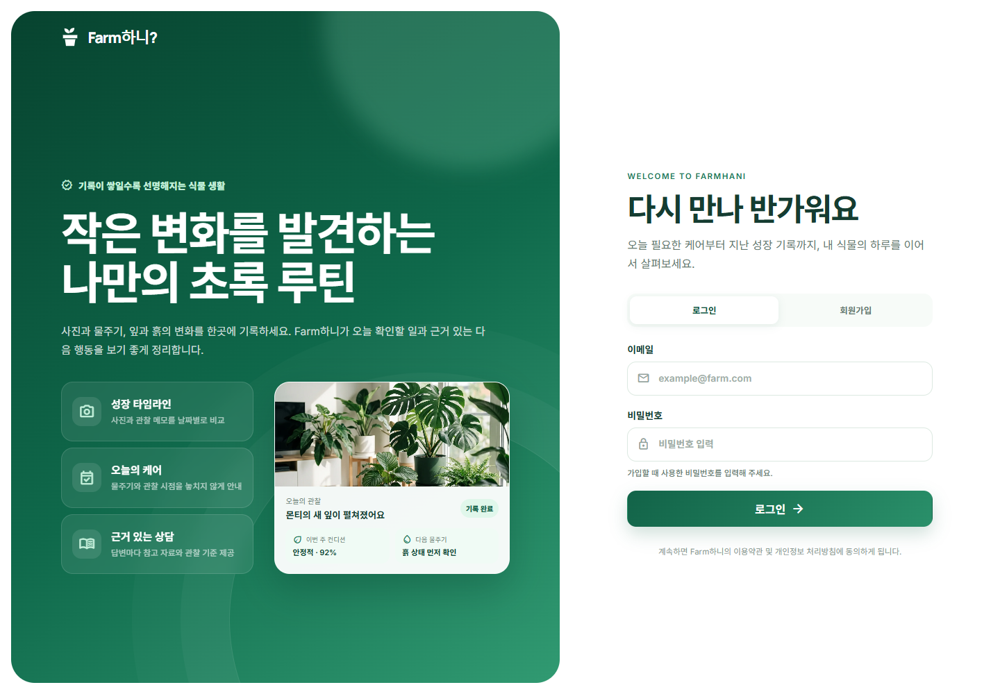
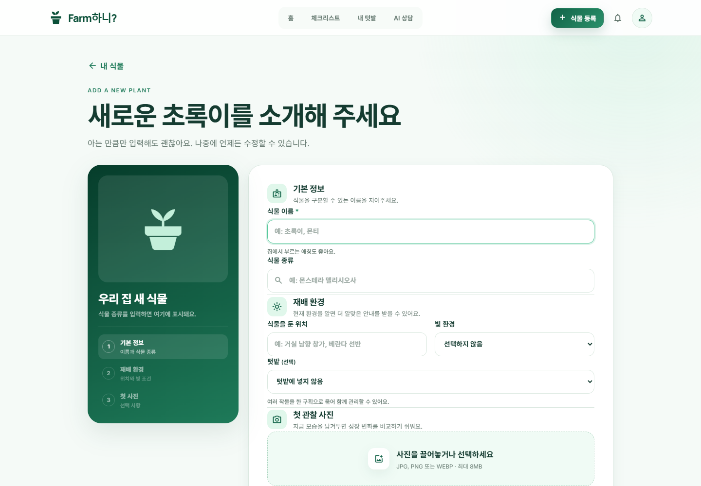
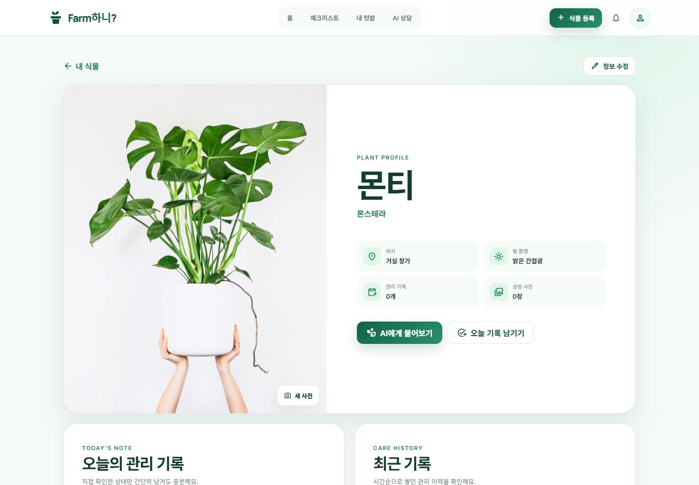
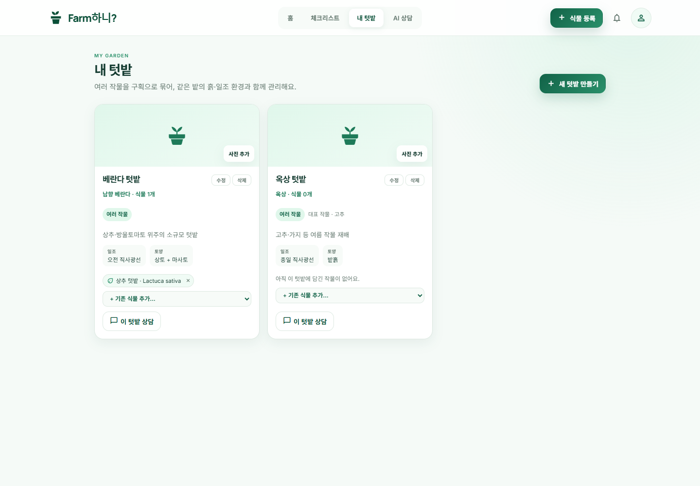
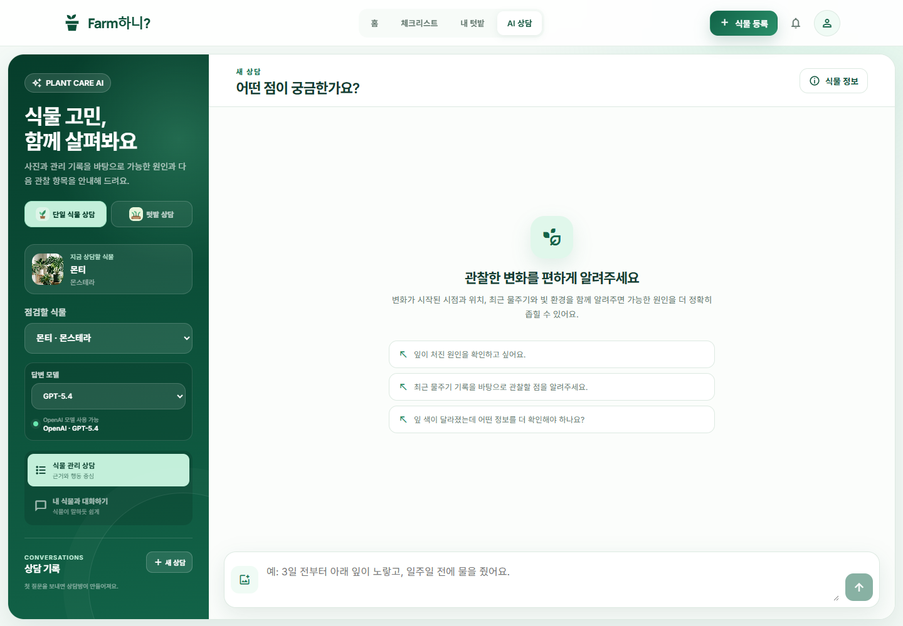
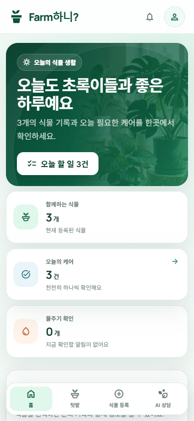
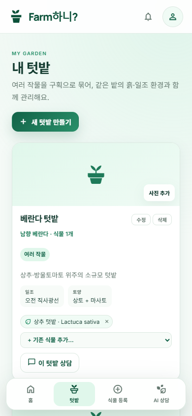
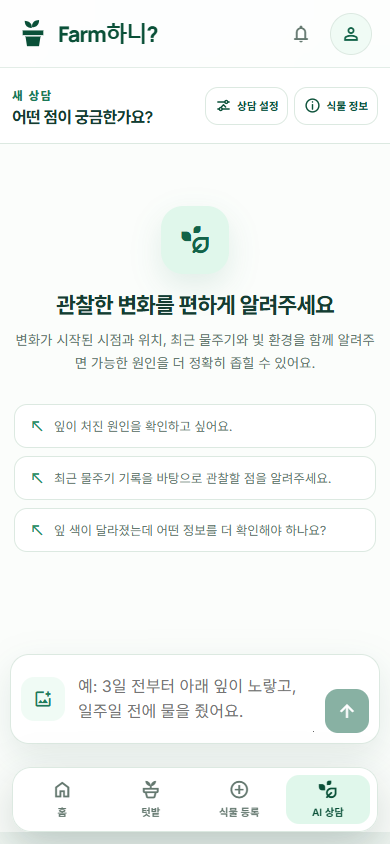

# Farm하니 v2 화면설계서

| 항목 | 내용 |
|---|---|
| 문서명 | Farm하니 v2 화면설계서 |
| 프로젝트 | SKN30 4차 단위 프로젝트 · Farm하니 v2 |
| 문서 버전 | 1.0 |
| 작성일 | 2026-07-31 |
| 기준 브랜치 | `develop` |
| 기준 커밋 | `f55fd35` |
| 관련 문서 | `Farm하니_v2_요구사항_정의서.md` |
| 배포 URL | <https://farmhani.vercel.app/> |
| 문서 상태 | 4차 프로젝트 산출물 제출용 초안 |

## 1. 문서 목적

본 문서는 Farm하니 v2의 PC·모바일 화면 구조와 사용자 상호작용을 정의한다. 화면별 목적, 진입 조건, 구성 요소, 상태 변화, 예외 처리와 연결 요구사항을 명시하여 다음 작업의 기준으로 사용한다.

- 프론트엔드 구현 및 회귀 검증
- 사용자 시나리오 기반 통합 테스트
- 요구사항 추적
- 최종 발표자료 작성
- PDF 제출용 화면 산출물 제작

## 2. PDF 변환 기준

화면 캡처와 설명을 함께 배치하기 위해 본 문서는 다음 출력 조건을 권장한다.

| 항목 | 권장값 |
|---|---|
| 용지 | A4 |
| 방향 | 가로(Landscape) |
| 여백 | 상·하 12mm, 좌·우 14mm |
| 본문 글꼴 | Pretendard 또는 Noto Sans KR |
| 본문 크기 | 9.5~10.5pt |
| 제목 크기 | H1 22pt, H2 16pt, H3 13pt |
| 표 | 페이지 폭 100%, 긴 문장은 자동 줄바꿈 |
| 이미지 | 페이지 본문 폭 이내, 원본 비율 유지 |
| 이미지 설명 | 이미지 바로 아래에 화면 ID와 캡처 기준 표기 |
| 페이지 분리 | 화면 단위로 페이지를 분리하고 이미지와 구성요소 표를 가능한 한 같은 페이지에 배치 |

PDF 변환 시 Markdown 이미지 경로는 본 문서 기준 상대경로인 `assets/screens-v2/*.png`를 유지한다. HTML/CSS 기반 변환 도구를 사용할 경우 `img { max-width: 100%; height: auto; }`, `table { break-inside: avoid; }`, `h2 { break-before: page; }` 규칙을 권장한다.

## 3. 화면 캡처 기준

| 구분 | 기준 |
|---|---|
| 로그인 화면 | Vercel 배포 환경 `https://farmhani.vercel.app/` |
| 인증 후 화면 | 동일 `develop` 코드의 개발용 mock 모드 |
| PC 해상도 | 1440 × 1000px |
| 모바일 해상도 | 390 × 844px |
| 데이터 | 실제 사용자 정보가 아닌 화면설계용 예시 식물·텃밭 데이터 |
| 촬영일 | 2026-07-31 |

인증 후 화면은 실제 사용자 데이터와 토큰이 산출물 이미지에 포함되지 않도록 mock 데이터를 사용했다. UI 컴포넌트, 레이아웃과 반응형 CSS는 현재 `develop` 구현과 동일하다.

## 4. v1에서 v2로의 화면 구조 개선

| 구분 | Farm하니 v1 | Farm하니 v2 |
|---|---|---|
| 렌더링 | React 실행 환경에서 정적 `design/*.html`을 직접 표시 | 화면을 React TSX 컴포넌트로 구성 |
| 상호작용 | `querySelector`, `getElementById`, `innerHTML` 등 직접 DOM 조작 혼재 | React state, props, event 기반 선언형 처리 |
| 화면 분리 | HTML 시안과 페이지별 DOM 스크립트 | `components/pages` 기반 페이지 컴포넌트 |
| 공통 UI | 화면별 중복 가능 | AppShell, Brand, PageState, NotificationMenu 공통화 |
| 데이터 연결 | 시안 보존 및 단계적 API 연결 | `api.ts`, `types.ts`, storage 유틸리티로 연결 계층 분리 |
| 반응형 | 정적 시안별 대응 | PC 헤더와 모바일 하단 내비게이션을 포함한 통합 반응형 |
| 상담 | 단일 식물 중심 | 단일 식물·텃밭 전환, 모델 선택, 모바일 설정 패널 |

## 5. 정보 구조

### 5.1 화면 목록

| 화면 ID | 화면명 | 해시 경로 | 인증 | 핵심 기능 |
|---|---|---|---|---|
| SCR-01 | 로그인/회원가입 | `#login` | 불필요 | 로그인, 회원가입, 서비스 소개 |
| SCR-02 | 대시보드/내 식물 | `#dashboard` | 필요 | 식물 현황, 체크리스트, 검색, 선택 삭제 |
| SCR-03 | 식물 등록 | `#add` | 필요 | 기본정보, 재배환경, 텃밭 배정, 첫 사진 |
| SCR-04 | 식물 상세 | `#detail` | 필요 | 프로필, 사진, 관리 기록, 정보 수정, 상담 이동 |
| SCR-05 | 내 텃밭 | `#garden` | 필요 | 텃밭 CRUD, 사진, 재배 유형, 식물 배정, 텃밭 상담 |
| SCR-06 | AI 상담 PC | `#chat` | 필요 | 단일·텃밭 상담, 모델 선택, 사진·텍스트 질문, 출처 |
| SCR-07 | 대시보드 모바일 | `#dashboard` | 필요 | 모바일 식물 현황과 하단 내비게이션 |
| SCR-08 | 내 텃밭 모바일 | `#garden` | 필요 | 세로형 텃밭 카드와 하단 내비게이션 |
| SCR-09 | AI 상담 모바일 | `#chat` | 필요 | 채팅 우선 배치, 설정 패널 토글, 사진·텍스트 입력 |

### 5.2 주요 이동 흐름

| 시작 | 사용자 행동 | 도착 |
|---|---|---|
| SCR-01 | 로그인 성공 또는 체험 화면 시작 | SCR-02 |
| SCR-02 | 식물 등록 | SCR-03 |
| SCR-02 | 식물 카드 선택 | SCR-04 |
| SCR-02 | 내 텃밭 메뉴 | SCR-05 |
| SCR-02/SCR-04 | AI 상담 또는 빠른 진단 | SCR-06 |
| SCR-03 | 식물 등록 완료 | SCR-02 또는 SCR-04 |
| SCR-04 | 식물 정보 수정 | SCR-04 하단 편집 영역 |
| SCR-05 | 이 텃밭 상담 | SCR-06의 텃밭 상담 상태 |
| SCR-06 | 단일 식물/텃밭 상담 전환 | SCR-06 내부 상태 변경 |
| SCR-06 | 식물 정보/텃밭 정보 | SCR-04 또는 SCR-05 |

## 6. 공통 디자인 시스템

### 6.1 색상

| 용도 | 토큰 | 값 |
|---|---|---|
| 최심도 브랜드 녹색 | `--green-950` | `#063D2B` |
| 주요 브랜드 녹색 | `--green-900` | `#0A5038` |
| 기본 액션 녹색 | `--green-700` | `#1E7A59` |
| 민트 강조 | `--mint-500` | `#55C89A` |
| 연한 민트 배경 | `--mint-100` | `#E0F7EB` |
| 기본 텍스트 | `--ink` | `#153C31` |
| 보조 텍스트 | `--muted` | `#64786F` |
| 구분선 | `--line` | `#DCE9E1` |
| 기본 화면 배경 | 전역 배경 | `#F5FAF7` |
| 경고 | `--warning` | `#B65E32` |
| 오류/삭제 | `--danger` | `#BD3E48` |

### 6.2 타이포그래피와 형태

| 요소 | 설계 기준 |
|---|---|
| 기본 글꼴 | Pretendard, Inter, Noto Sans KR 및 시스템 글꼴 순서 |
| 제목 | 굵은 두께, 음수 자간, 한글 단어 단위 줄바꿈 |
| 본문 | 1.6~1.7 수준의 줄간격으로 가독성 확보 |
| 카드 | 12·18·28px 단계의 둥근 모서리 사용 |
| 그림자 | 정보 위계에 따라 소·중·대 3단계 사용 |
| 아이콘 | 로컬 Material Symbols 폰트 또는 고정 SVG 사용 |
| 입력 포커스 | 브랜드 녹색 계열 outline 제공 |

### 6.3 공통 PC 헤더

| 위치 | 구성 | 동작 |
|---|---|---|
| 좌측 | Farm하니 로고 | 대시보드 이동 |
| 중앙 | 홈, 체크리스트, 내 텃밭, AI 상담 | 현재 화면 강조 및 페이지 이동 |
| 우측 | 식물 등록, 알림, 프로필 | 등록 화면, 알림 패널, 프로필/로그아웃 |

### 6.4 공통 모바일 하단 내비게이션

| 순서 | 메뉴 | 이동 화면 |
|---:|---|---|
| 1 | 홈 | SCR-07 |
| 2 | 텃밭 | SCR-08 |
| 3 | 식물 등록 | SCR-03 |
| 4 | AI 상담 | SCR-09 |

체크리스트는 모바일 하단 내비게이션에서 제외하고 대시보드 안에서 제공한다. 메뉴는 한 행에 네 항목을 유지하며 현재 메뉴를 민트색 배경으로 강조한다.

## 7. 화면 상세 설계

### 7.1 SCR-01 로그인/회원가입

_SCR-01 · PC 1440×1000 · Vercel 배포 화면_

#### 화면 목적

사용자 인증을 수행하고, 로그인 전에 서비스가 제공하는 성장 기록·오늘의 케어·근거 있는 상담 가치를 전달한다.

#### 화면 영역

| 영역 | 구성요소 | 설명 |
|---|---|---|
| A. 브랜드 소개 | 로고, 핵심 문구, 서비스 설명 | 식물 관리 기록과 상담 서비스의 가치를 전달 |
| B. 기능 요약 | 성장 타임라인, 오늘의 케어, 근거 있는 상담 | 로그인 전 주요 기능을 간결하게 소개 |
| C. 미리보기 카드 | 관찰 기록, 컨디션, 다음 물주기 | 실제 사용 화면을 축약해 시각화 |
| D. 인증 전환 | 로그인/회원가입 탭 | 동일 화면에서 인증 모드 변경 |
| E. 입력 폼 | 이메일, 비밀번호 | 필수 입력값과 안내 문구 제공 |
| F. 실행 버튼 | 로그인 또는 가입하기 | 입력값 검증 후 Supabase Auth 호출 |
| G. 개발 전용 체험 | 체험 화면 시작 | 개발 mock 환경에서만 표시, 운영 배포에서는 숨김 |

#### 주요 동작 및 상태

| 조건/행동 | 결과 |
|---|---|
| 로그인 탭 선택 | 로그인 제목과 실행 버튼 표시 |
| 회원가입 탭 선택 | 회원가입 문구와 가입 버튼 표시 |
| 잘못된 계정 정보 | 입력 폼 주변에 오류 메시지 표시 |
| 이메일 미인증 | 이메일 확인 안내 표시 |
| 로그인 성공 | SCR-02 대시보드로 이동 |
| 인증 세션 보유 | 보호 화면 접근 시 로그인 화면을 건너뜀 |

**연결 요구사항:** FR-AUTH-001~004, FR-UI-001~002, NFR-SEC-001~003

### 7.2 SCR-02 대시보드/내 식물

_SCR-02 · PC 1440×1000 · mock 데이터_

#### 화면 목적

등록 식물 수, 오늘 할 일, 물주기 확인과 식물 목록을 한 화면에서 제공하고 관리·상담 기능의 시작점 역할을 한다.

#### 화면 영역

| 영역 | 구성요소 | 설명 |
|---|---|---|
| A. 히어로 | 오늘의 식물 생활, 등록 식물 수, 오늘 할 일 | 가장 중요한 요약과 체크리스트 이동 제공 |
| B. 요약 카드 | 함께하는 식물, 오늘의 케어, 물주기 확인 | 주요 지표를 카드로 표시 |
| C. 내 식물 헤더 | 전체 선택, 선택 삭제, 검색 | 다중 식물 관리와 필터링 |
| D. 식물 카드 | 대표 사진, 사용자 이름, 종류, 상태 | 식물별 현재 상태와 상세 진입 제공 |
| E. 체크리스트 | 오늘 할 일 목록과 완료 상태 | 관리 행동을 순차적으로 확인 |

#### 주요 동작

| 행동 | 결과 |
|---|---|
| 식물 카드 선택 | 해당 식물을 선택 상태로 저장하고 SCR-04 이동 |
| 전체 선택 | 현재 목록의 모든 선택 체크박스를 활성화 |
| 선택 삭제 | 선택 항목 확인 후 해당 식물만 삭제 |
| 식물 검색 | 이름, 종류, 위치 기준으로 카드 필터링 |
| 물주기 기록 | 해당 식물의 관리 기록에 관수 상태 반영 |
| 식물 등록 | SCR-03 이동 |

#### 상태 및 예외

| 상태 | 표시 방식 |
|---|---|
| 로딩 | 공통 PageState 로딩 화면 |
| 식물 0건 | 식물 등록을 유도하는 빈 상태 |
| 선택 0건 | 선택 삭제 버튼 비활성화 |
| 사진 없음/오류 | 기본 식물 이미지 표시 |
| 삭제 진행 | 중복 클릭을 막고 처리 중 상태 표시 |

**연결 요구사항:** FR-PLANT-003, FR-PLANT-007~011, FR-UI-007~010

### 7.3 SCR-03 식물 등록

_SCR-03 · PC 1440×1000 · mock 데이터_

#### 화면 목적

식물 별명, 종류, 재배환경, 텃밭 소속과 첫 관찰 사진을 한 번에 등록한다.

#### 화면 영역

| 영역 | 구성요소 | 필수 여부 |
|---|---|---:|
| A. 미리보기 | 기본 이미지, 입력 중인 이름·종류 | 자동 반영 |
| B. 단계 안내 | 기본정보, 재배환경, 첫 사진 | 안내 |
| C. 식물 이름 | 사용자가 부르는 별명 | 필수 |
| D. 식물 종류 | 카탈로그 검색과 자동완성 | 필수 |
| E. 재배 위치 | 거실, 베란다 등 | 선택 |
| F. 빛 환경 | 선택 목록 | 선택 |
| G. 텃밭 | 기존 텃밭 선택 또는 새 텃밭 생성 | 선택 |
| H. 첫 사진 | 클릭·드래그앤드롭 이미지 첨부 | 선택 |
| I. 등록 버튼 | 입력값 검증 및 저장 | 필수 |

#### 주요 동작 및 검증

| 행동/조건 | 결과 |
|---|---|
| 식물 종류 입력 | 한글명·학명 기준 카탈로그 후보 표시 |
| 새 텃밭 선택 | 새 텃밭 이름 입력란 추가 표시 |
| 사진 선택 | 형식·8MB 제한 검증 후 미리보기 표시 |
| 등록 완료 | 식물 생성 후 사진 업로드, 대표 이미지 반영 |
| 필수값 누락 | 해당 입력란과 오류 메시지 표시 |
| 등록 실패 | 입력값을 유지하고 재시도 가능한 오류 표시 |

**연결 요구사항:** FR-PLANT-001~004, FR-GARDEN-004, FR-UI-007~010, NFR-SEC-005

### 7.4 SCR-04 식물 상세

_SCR-04 · PC 1440×1000 · 선택 식물 mock 데이터_

#### 화면 목적

선택 식물의 프로필, 대표 사진, 관리 상태와 재배 기록을 확인하고 정보 수정·사진 변경·상담으로 이동한다.

#### 화면 영역

| 영역 | 구성요소 | 설명 |
|---|---|---|
| A. 식물 요약 | 대표 이미지, 이름, 한글 종류, 위치 | 사용자 중심 식별 정보 제공 |
| B. 빠른 행동 | AI 상담, 정보 수정, 사진 변경 | 주요 후속 작업으로 이동 |
| C. 상태 카드 | 건강 상태, 수분, 빛, 다음 할 일 | 현재 관리 상태 요약 |
| D. 관리 기록 | 날짜, 물주기, 관찰 메모 | 과거 기록 조회·수정·삭제 |
| E. 기록 입력 | 물주기·관찰·메모 추가 | 새로운 관리 기록 저장 |
| F. 정보 수정 폼 | 이름, 종류, 위치, 빛, 텃밭 | 수정 버튼 클릭 시 하단 표시 |

#### 주요 동작

| 행동 | 결과 |
|---|---|
| 사진 변경 | 업로드 완료 후 상세·대시보드 대표 사진 동시 갱신 |
| 정보 수정 | 편집 폼 표시 후 해당 영역으로 부드럽게 스크롤 |
| 기록 추가/수정/삭제 | 목록과 상담 컨텍스트에 최신 기록 반영 |
| AI 상담 | 선택 식물을 유지한 채 SCR-06으로 이동 |
| 선택 식물 없음 | ‘선택된 식물이 없어요’ 빈 상태와 대시보드 이동 버튼 표시 |

**연결 요구사항:** FR-PLANT-005~007, FR-PLANT-010, FR-CHAT-004, FR-UI-007~010

### 7.5 SCR-05 내 텃밭

_SCR-05 · PC 1440×1000 · mock 데이터_

#### 화면 목적

텃밭을 구획 단위로 관리하고 재배 유형, 대표 작물, 환경, 대표 사진과 소속 식물을 설정한다.

#### 화면 영역

| 영역 | 구성요소 | 설명 |
|---|---|---|
| A. 화면 헤더 | 내 텃밭 설명, 새 텃밭 만들기 | 목록의 목적과 생성 행동 제공 |
| B. 텃밭 이미지 | 대표 사진 또는 기본 아이콘, 사진 추가/변경 | 텃밭 시각적 식별 |
| C. 텃밭 기본정보 | 이름, 위치, 작물 수, 설명 | 요약 정보 제공 |
| D. 재배 조건 | 단일/여러 작물, 대표 작물, 일조, 토양 | 상담에 사용할 환경 정보 |
| E. 소속 식물 | 식물 칩, 제거 버튼, 기존 식물 추가 | 중복 없는 구성원 관리 |
| F. 카드 행동 | 수정, 삭제, 이 텃밭 상담 | 텃밭 관리 및 상담 이동 |

#### 생성·수정 폼

| 항목 | 규칙 |
|---|---|
| 텃밭 이름 | 필수, 최대 40자 |
| 위치·설명 | 선택 입력 |
| 텃밭 유형 | 단일 작물 또는 여러 작물 |
| 대표 작물 | 단일 작물 유형일 때 필수 |
| 일조·토양 | 선택 입력, 상담 컨텍스트에 반영 |
| 대표 사진 | JPG·PNG·WEBP, 최대 8MB |

#### 주요 동작 및 예외

| 행동/조건 | 결과 |
|---|---|
| 기존 식물 추가 | 등록된 식물 한 건을 텃밭에 배정 |
| 별명과 종류가 함께 있음 | 동일 식물을 두 건으로 복제하지 않고 한 건으로 표시 |
| 구성원 제거 | 식물은 유지하고 텃밭 배정만 해제 |
| 텃밭 삭제 | 확인 후 텃밭만 삭제하고 모든 식물은 유지 |
| 이 텃밭 상담 | 선택 텃밭을 저장하고 SCR-06 텃밭 모드로 이동 |
| 텃밭 0건 | 첫 텃밭 생성을 안내하는 빈 상태 표시 |

**연결 요구사항:** FR-GARDEN-001~008, FR-CHAT-017, FR-UI-007~010

### 7.6 SCR-06 AI 상담 — PC

_SCR-06 · PC 1440×1000 · mock 데이터 및 빈 상담 세션_

#### 화면 목적

단일 식물 또는 텃밭을 대상으로 텍스트·이미지 질문을 전송하고, 선택한 LLM이 공식 문서 RAG와 사용자 기록에 기반한 답변을 제공한다.

#### PC 레이아웃

| 영역 | 구성요소 | 설명 |
|---|---|---|
| A. 설정 사이드바 | 상담 범위, 대상, 모델, 모드, 상담 기록 | 상담 컨텍스트와 설정을 왼쪽에 고정 |
| B. 상담 헤더 | 새 상담 제목, 식물/텃밭 정보 이동 | 현재 작업과 대상 정보 이동 제공 |
| C. 대화 영역 | 사용자 질문, 첨부 이미지, AI 답변, 출처 | 상담 이력의 중심 영역 |
| D. 입력 영역 | 이미지 첨부, 자동 높이 입력창, 전송 | 질문 작성 및 전송 |

#### 설정 사이드바

| 요소 | 선택지/표시 | 동작 |
|---|---|---|
| 상담 범위 | 단일 식물 상담, 텃밭 상담 | 대상 목록과 컨텍스트 전환 |
| 현재 대상 | 실제 대표 이미지, 이름, 종류/환경 | 지금 상담할 대상을 명확히 표시 |
| 대상 선택 | 등록 식물 또는 텃밭 | 선택값을 이후 요청에 사용 |
| 답변 모델 | GPT-5.4, GPT-5.5, GPT-5.6, Local Qwen3-VL | 선택 모델 ID를 요청에 포함 |
| 모델 상태 | 초록: 사용 가능, 빨강: 사용 불가 | 제공자 종류가 아닌 실제 상태 기준 |
| 답변 모드 | 식물 관리 상담, 내 식물과 대화하기 | 단일 식물 상담에서 답변 말투 전환 |
| 상담 기록 | 새 상담, 세션 목록, 삭제 | 대상·모드별 대화 이력 관리 |

#### 질문과 답변 표시 규칙

| 항목 | 설계 규칙 |
|---|---|
| 사용자 이미지 | 해당 사용자 질문 위에 표시 |
| 사용자 질문 | 오른쪽 또는 사용자 구분 말풍선에 표시 |
| AI 답변 | 요약, 가능한 원인, 오늘 할 일, 관찰 항목 순서 |
| 출처 | 제목, 발행기관, URL/ID, 발췌문을 별도 영역에 표시 |
| 근거 0건 | 공식 근거 부족을 명시하고 추가 사진·기록 요청 |
| 농약 내용 | 라벨·안전사용기준·전문가 확인 안내 포함 |
| 내 식물 대화 | 친근한 1인칭 말투와 마지막 식물 이모티콘 한 개 |

#### 입력 상호작용

| 행동 | 결과 |
|---|---|
| 이미지 버튼 | 파일 선택 창 열기 |
| 이미지 드래그앤드롭 | 입력 영역에 미리보기 첨부 |
| 클립보드 이미지 붙여넣기 | 미리보기 첨부 |
| 이미지 제거 | 전송 전 첨부 해제 |
| 질문 전송 | 이미지 업로드 후 10단계 상담 진행 |
| 전송 중 | 진행 단계와 처리 문구 표시, 중복 전송 제한 |

**연결 요구사항:** FR-CHAT-001~017, FR-LLM-001~010, FR-VISION-001~005, FR-RAG-001~012

### 7.7 SCR-07 대시보드 — 모바일

_SCR-07 · 모바일 390×844 · mock 데이터_

#### 모바일 재배치 규칙

| PC 요소 | 모바일 처리 |
|---|---|
| 중앙 상단 내비게이션 | 숨김 |
| 우측 식물 등록 버튼 | 하단 내비게이션의 식물 등록으로 이동 |
| 히어로 | 텍스트와 배경 이미지를 한 카드로 축소 |
| 요약 카드 3개 | 세로 한 열 배치 |
| 식물 카드 | 한 열 또는 화면 폭에 맞춘 카드 배치 |
| 체크리스트 | 대시보드 콘텐츠 안에서 제공 |
| 하단 내비게이션 | 화면 하단 고정, 한 행 4개 |

#### 모바일 사용성 기준

- 첫 화면에서 오늘 할 일과 주요 상태가 우선 보인다.
- 하단 내비게이션이 콘텐츠를 가리지 않도록 하단 여백을 확보한다.
- 터치 대상은 아이콘과 라벨을 함께 제공한다.
- 가로 스크롤 없이 최소 320px 폭까지 동작한다.

**연결 요구사항:** FR-UI-003~010, FR-PLANT-008~011

### 7.8 SCR-08 내 텃밭 — 모바일

_SCR-08 · 모바일 390×844 · mock 데이터_

#### 모바일 재배치 규칙

| PC 요소 | 모바일 처리 |
|---|---|
| 텃밭 카드 목록 | 한 열 세로 배치 |
| 사진 영역 | 카드 상단 전체 폭 사용 |
| 수정·삭제 | 이름 오른쪽의 작은 버튼으로 유지 |
| 환경 정보 | 작은 정보 카드로 줄바꿈 |
| 식물 추가 선택 | 카드 전체 폭 사용 |
| 이 텃밭 상담 | 카드 하단에서 명확히 표시 |

#### 모바일 사용성 기준

- `PHOTO`와 같은 불필요한 큰 영문 장식 문구를 사용하지 않는다.
- 사진 추가는 아이콘 또는 짧은 한글 라벨로 제공한다.
- 소속 식물 칩과 제거 버튼이 한 화면 폭 안에서 자연스럽게 줄바꿈한다.
- 하단 내비게이션과 마지막 카드 사이에 안전 여백을 둔다.

**연결 요구사항:** FR-GARDEN-001~008, FR-UI-003~010

### 7.9 SCR-09 AI 상담 — 모바일

_SCR-09 · 모바일 390×844 · mock 데이터 및 빈 상담 세션_

#### 모바일 레이아웃

| 영역 | 구성요소 | 설계 규칙 |
|---|---|---|
| A. 상단 바 | 새 상담 제목, 상담 설정, 정보 이동 | 최소 높이로 주요 버튼 제공 |
| B. 채팅 영역 | 대화 이력과 상태 | 설정 화면보다 먼저 표시 |
| C. 입력 영역 | 이미지 첨부, 질문 입력, 전송 | 하단 내비게이션 위에 고정 |
| D. 하단 내비게이션 | 홈, 텃밭, 식물 등록, AI 상담 | AI 상담 항목 활성화 |
| E. 설정 패널 | PC 사이드바와 동일한 설정 | 화면 왼쪽에서 펼침/접기 |

#### 상담 설정 버튼 동작

1. 기본 상태에서는 설정 패널을 닫아 채팅 영역을 우선 표시한다.
2. `상담 설정` 버튼을 누르면 설정 패널이 왼쪽에서 열린다.
3. 같은 `상담 설정` 버튼 또는 배경 영역을 누르면 패널이 닫힌다.
4. 별도의 X 버튼만으로 닫아야 하는 흐름을 강제하지 않는다.
5. 버튼은 의미가 불분명한 `TUNE` 텍스트 대신 아이콘과 한글 라벨을 함께 사용한다.

#### 모바일 입력 기준

- 텍스트 입력창은 초기 상태에서 과도하게 세로로 길지 않아야 한다.
- 내용이 늘어날 때만 제한 범위 안에서 높이가 증가한다.
- 이미지 첨부 버튼은 입력창 세로 중앙에 정렬한다.
- 질문 이미지 미리보기와 제거 버튼은 전송 전에 확인 가능해야 한다.
- 입력 영역과 하단 내비게이션이 겹치지 않아야 한다.

**연결 요구사항:** FR-CHAT-002~010, FR-UI-003~010, NFR-ACC-001~003

## 8. 공통 화면 상태 설계

### 8.1 로딩 상태

| 대상 | 표시 방식 |
|---|---|
| 화면 최초 로드 | 중앙 로고, 제목, 보조 문구, skeleton 선 |
| 상담 세션 로드 | 대화 영역 안에 spinner와 상태 문구 |
| 상담 생성 | LangGraph 단계 번호와 현재 처리 문구 |
| 사진 업로드 | 업로드 중 문구와 중복 실행 방지 |

### 8.2 빈 상태

| 조건 | 메시지/행동 |
|---|---|
| 식물 없음 | 먼저 식물을 등록하도록 안내, 식물 등록 버튼 |
| 선택 식물 없음 | ‘선택된 식물이 없어요’, 내 식물로 이동 |
| 텃밭 없음 | 첫 텃밭 생성 안내, 새 텃밭 만들기 |
| 상담 세션 없음 | 첫 질문을 보내면 상담방이 생성된다는 안내 |
| 검색 결과 없음 | 검색어 변경 또는 새 식물 등록 안내 |

### 8.3 오류 상태

| 오류 | 사용자 표시 | 후속 행동 |
|---|---|---|
| 인증 만료 | 로그인 필요 안내 | SCR-01 이동 |
| API 연결 실패 | 기능별 실패 메시지 | 재시도 또는 입력 유지 |
| 이미지 용량 초과 | 실제 파일 크기와 8MB 제한 안내 | 다른 이미지 선택 |
| 모델 사용 불가 | 선택 모델 연결 실패 상태 | 다른 모델 선택 또는 재시도 |
| OpenAI·로컬 모두 실패 | 모델 사용 불가를 명확히 안내 | 설정·RunPod·키 상태 확인 |
| 근거 문서 0건 | 공식 근거 부족 명시 | 추가 사진·기록 요청 |

### 8.4 확인 상태

삭제 동작은 즉시 실행하지 않고 대상과 영향을 확인할 수 있어야 한다.

| 동작 | 확인 내용 |
|---|---|
| 식물 선택 삭제 | 선택한 식물만 삭제됨 |
| 상담방 삭제 | 해당 상담 기록만 삭제됨 |
| 텃밭 삭제 | 텃밭만 삭제되고 식물은 유지됨 |

## 9. 접근성 설계

1. 모든 입력 요소는 시각적 라벨 또는 접근 가능한 이름을 가진다.
2. 아이콘만 있는 삭제·첨부·설정 버튼에는 `aria-label`을 제공한다.
3. 모델 상태는 초록·빨강 색상 외에 ‘사용 가능’, ‘연결 안 됨’ 문구를 함께 표시한다.
4. 현재 내비게이션 항목은 `aria-current="page"`로 구분한다.
5. 로딩 상태에는 `role="status"`를 제공한다.
6. 장식용 이미지는 빈 대체 텍스트를 사용하고, 정보성 이미지는 대상 이름을 대체 텍스트로 제공한다.
7. 키보드 포커스 outline을 제거하지 않고 브랜드 색상으로 표시한다.
8. 편집 영역 자동 스크롤 후 포커스 이동이 사용자 입력을 방해하지 않도록 한다.

## 10. 요구사항 추적표

| 화면 ID | 주요 기능 요구사항 | 주요 비기능 요구사항 |
|---|---|---|
| SCR-01 | FR-AUTH-001~004 | NFR-SEC-001~003, NFR-ACC-001~002 |
| SCR-02 | FR-PLANT-003, 007~011 | NFR-PERF-001, NFR-COMP-001~002 |
| SCR-03 | FR-PLANT-001~004, FR-GARDEN-004 | NFR-SEC-005, NFR-ACC-001~002 |
| SCR-04 | FR-PLANT-005~007, 010 | NFR-REL-004, NFR-COMP-001~002 |
| SCR-05 | FR-GARDEN-001~008 | NFR-SEC-001, NFR-REL-004 |
| SCR-06 | FR-CHAT-001~017, FR-LLM-001~010, FR-VISION-001~005, FR-RAG-001~012 | NFR-REL-002~005, NFR-PERF-002~004 |
| SCR-07 | FR-PLANT-008~011, FR-UI-003~010 | NFR-COMP-001~002, NFR-ACC-001~003 |
| SCR-08 | FR-GARDEN-001~008, FR-UI-003~010 | NFR-COMP-001~002, NFR-ACC-001~003 |
| SCR-09 | FR-CHAT-002~010, FR-UI-003~010 | NFR-REL-002~003, NFR-ACC-001~003 |

## 11. PDF 제출 전 확인 항목

- [ ] 모든 이미지가 누락 없이 렌더링되는지 확인한다.
- [ ] 이미지가 가로로 늘어나거나 찌그러지지 않는지 확인한다.
- [ ] 화면 캡처와 해당 화면의 제목·설명이 같은 페이지 또는 연속 페이지에 위치하는지 확인한다.
- [ ] 넓은 표의 마지막 열이 페이지 밖으로 잘리지 않는지 확인한다.
- [ ] 한글 폰트가 포함되거나 대체 글꼴로 정상 출력되는지 확인한다.
- [ ] Vercel 배포 URL이 클릭 가능한 링크로 유지되는지 확인한다.
- [ ] 실제 사용자 이메일, 토큰, API Key 등 민감정보가 이미지·본문에 없는지 확인한다.
- [ ] 페이지 번호, 문서 버전, 작성일을 머리말 또는 꼬리말에 추가한다.
- [ ] 최종 배포 화면과 문서 캡처의 차이가 없는지 제출 직전에 확인한다.
- [ ] PDF 파일명은 `Farm하니_v2_화면설계서.pdf`로 통일한다.

## 12. 변경 이력

| 버전 | 날짜 | 변경 내용 |
|---|---|---|
| 1.0 | 2026-07-31 | Farm하니 v2 PC·모바일 화면설계서 최초 작성 및 최신 화면 캡처 반영 |
